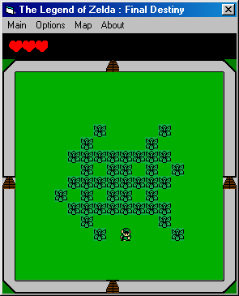



## Game Programming Tutorial v1\.2

### Description

*** Update ***

Source code is going to be included soon, I am

re-editing the whole document cause people said

my spelling sucked. And i am fixing all the

errors people have found and ones i have as well.

----

Wanna learn Pure vb game programming? I know I did until I found out that there are some good tutorials but they didnt help enough. This is an updated document i created to help people who know some vb and can understand what I am saying in the document. I try to explain everything I do to make it simple. Best of all it works I created my own games using this and plan on releasing my own game engine. I have created 4 games with this method and you will be able to create games with ease too. Please read everything in this document to understand how everything works. If you have ideas on improving or adding new functions to this please e-mail me or contact me digitalfx2k2@hotmail.com. Found a problem in my source please contact me too and tell me I will fix and upload it as soon as possible. Thanks and enjoy great games.
 
### More Info
 

             |
---                |---
**Submitted On**   |2002-05-29 22:50:20
**By**             |[John Zappone](https://github.com/Planet-Source-Code/PSCIndex/blob/master/ByAuthor/john-zappone.md)
**Level**          |Intermediate
**User Rating**    |5.0 (15 globes from 3 users)
**Compatibility**  |VB 5\.0, VB 6\.0
**Category**       |[Games](https://github.com/Planet-Source-Code/PSCIndex/blob/master/ByCategory/games__1-38.md)
**World**          |[Visual Basic](https://github.com/Planet-Source-Code/PSCIndex/blob/master/ByWorld/visual-basic.md)
**Archive File**   |[Game\_Progr882985292002\.zip](https://github.com/Planet-Source-Code/john-zappone-game-programming-tutorial-v1-2__1-35262/archive/master.zip)

